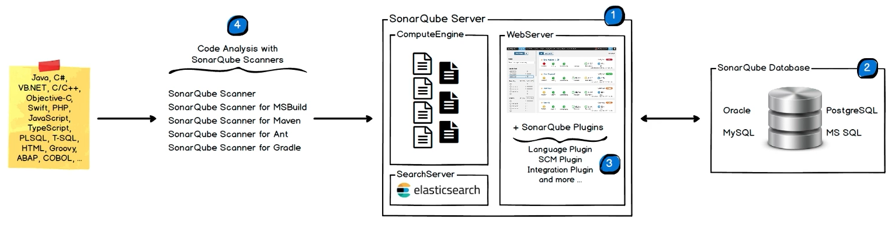
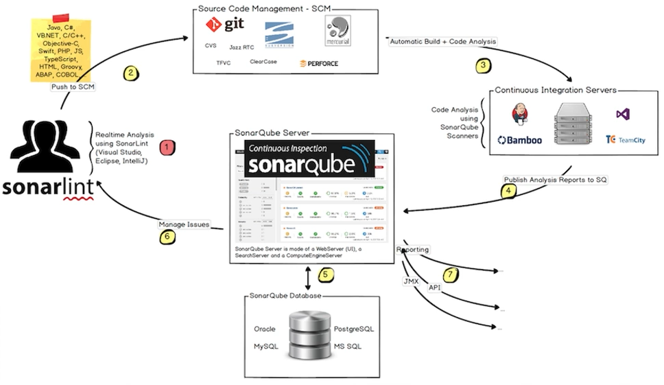

# 코드 품질을 위한 Sonarqube

정적 분석 :

- 분석대상 : 소스코드 또는 컴파일된 바이너리
- 테스트 범위 : 소스코드의 모든 부분
- 활용 : 개발단계에서 코드 상의 문제나 실수를 찾음

동적 분석 :

- 분석 대상 : 프로그램 실행 환경
- 테스트 범위 : 실행가능한 경로
- 활용 : 테스트, 모니터링

## 1. Sonarqube

> 정적분석의 대표적인 도구가 소나큐브이다. 개발된 코드의 지속적 정적 분석을 통해 품질 목표를 달성하게 하는 도구이다. 코드 품질 현황을 가시화, 리스크 분석, 코드에서 발생하는 문제를 해결하는 도구

- Project 코드 품질 측정 (웹 UI 상에서)

  - 프로젝트 코드의 품질 정보 측정
  - 빌드 및 통합 후 품질 변화 측정

- 폴리그랏 언어별 Rule 지원

  - JAVA, Go 등 언어별 Rule 지원
  - Jacoco등 분석 플러그인 지원

- Quality Profiles 관리

  - Rules 집합
  - 분석 Ruleset 정의 및 적용
  - Ruleset 기반 Profile 구성

- Quality Gates 설정

  - 다수 그룹의 품질 요구사항 설정
  - 다수 항목별 품질 요구사항 설정
  - 애플리케이션 릴리즈하기 전에, 애플리케이션이 품질 요구사항을 지키고 있는지
    확인하는 기준 목록, 이것을 통해 애플리케이션의 출시여부를 결정할 수 있다.

- Devops 와의 통합이 가능해, 빌드 시스템, CI 도구와 통합되어 Devops 방식으로관리 가능

<p align="center">
    
</p>

- 1. 개발자가 품질 스냅샷을 검색하고, 소나큐브 인스턴스를 구성하고, UI에서 검색을 지원하고, 코드 분석 보고서를 처리할 수 있다.
- 2. 데이터를 저장하는 sonarqube database, 보안, 플러그인 설정 등 소나큐브 인스턴스 구성 데이터 저장, 프로젝트 페이지에서 품질 정보를 스냅샷할 수 있다.
- 3. 여러가지의 폴리그랏 언어, SCM 연동, 인증 플러그인을 포함해서 서버에 설치 가능
- 4. 프로젝트 분석을 위해 gradle이나 jenkins와 같은 빌드,CI 도구에서 실행하는 요소이다.

## 2. Soanarqube, Jenkins CI 연동

<p align="center">
    
</p>

## 3. 설치

```
docker run --name sonarqube -d -p 9000:9000 sonarqube:latest
```

## 4. Sonarqube 코드 품질 설정 , Docker 빌드 스캔 수행

- gradle 에서 sonarqube 및 jacoco 플러그인 설정
- gradle 및 docker 빌드, sonarqube 정적분석 스캔 수행
- sonarqube에서 정적코드 품질분석 결과 확인

## 5. Jacoco

- Java code coverage
  - 자바 소스파일의 코드 커버리지 제공
  - 테스트케이스에 의한 테스트수 측정
- Instruction coverage
  - 코드 실행량 측정 커버리지
- Branch Coverage
  - if나 switch 문의 분기 확인
  - 실행된 것과 실행되지 않은 부분 측정
- Cyclomatic complexity
  - function 테스트시 최소 경로 정보
  - 모든 코드를 커버하기 위한 테스트 수

## 6. command

```sh
# 빌드 (빌드 과정 중 테스트 진행)
./gradlew clean build --info

# Jacoco 코드 커버리지 측정, 리포트 작성
./gradlew jacocoTestCoverageVerification --info
./gradlew jacocoTestReport --info

# Sonarqube 코드 품질 스캔 결과 연동
./gradlew sonarqube --info

# Docker 이미지 빌드 및 Push
./gradlew jib --console=plain
```
